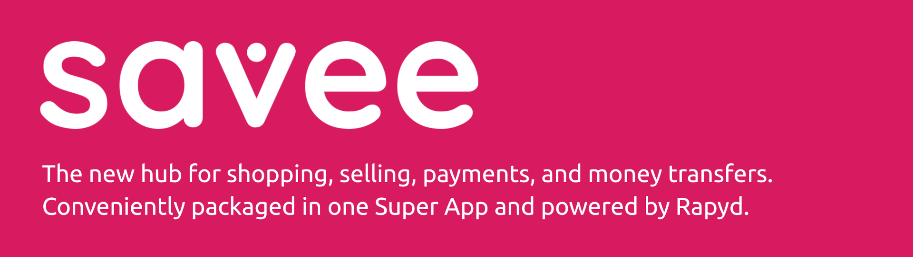
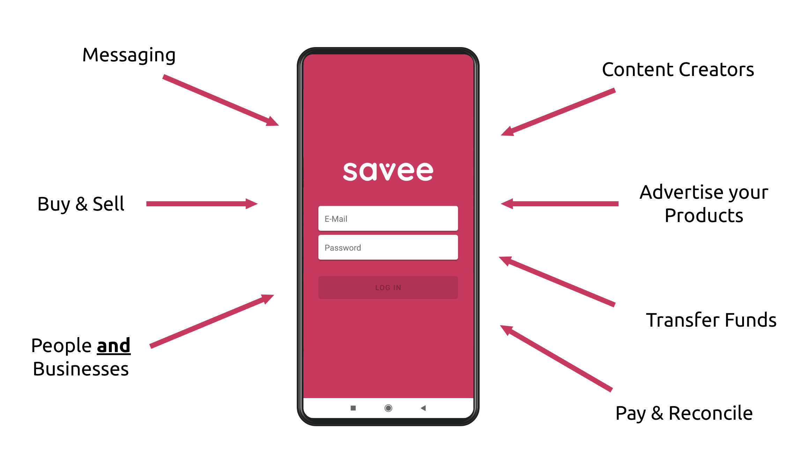
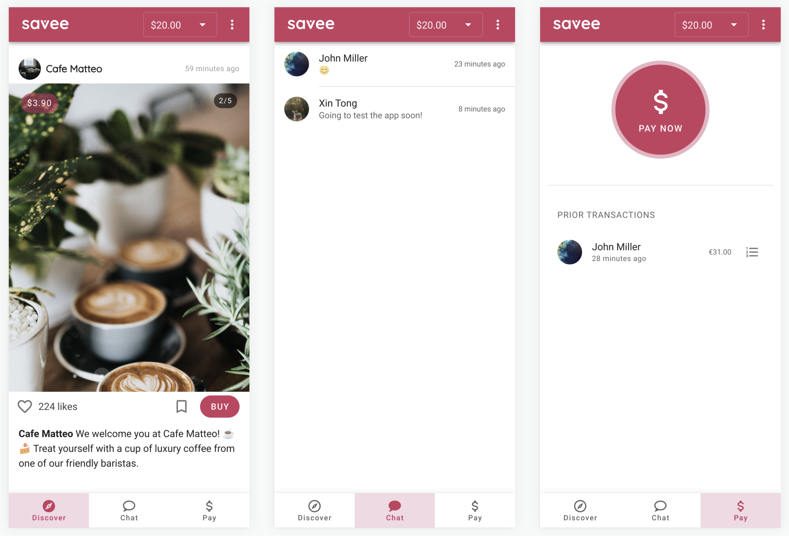
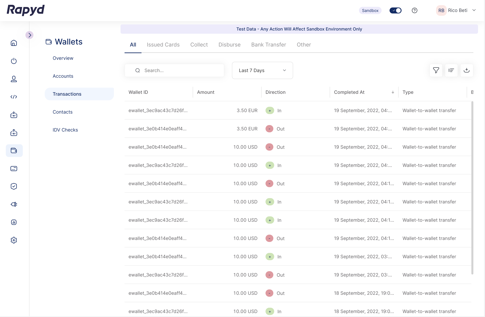

&nbsp;
&nbsp;

# Savee

Savee is the new hub for shopping, selling, payments, and money transfers. Conveniently packaged in one Super App and powered by [Rapyd](https://www.rapyd.net). This repository represents our submission for the [Build the Best Super App](https://aws5gedge.devpost.com/) challenge, the third instance of Rapyd's Hack The Galaxy Hackathon Series.

## Inspiration

As the digital world continues growing at an exponential rate, online payments become more and more important. In the wake of the mobile app revolution we have witnessed over the past decade, we have seen the rise of "Super Apps", apps which try to unify a large number of features (i.e. messaging, ride sharing, gaming, ...) in a single app and generally combine those features with the ability to send and receive money.

Savee is intended to be a central hub for everything that has to do with money and combines the financial aspect with social media, bringing people together with businesses and content creators.

## What it does

For this challenge, we focused on the integration with the excellent [Rapyd Wallet API](https://docs.rapyd.net/build-with-rapyd/docs/wallets). Essentially, each of our users is assigned a Rapyd Wallet that facilitates the instantaneous transfer of funds between users. 

The app, at this stage, is divided into three parts:

1) The Discovery Feed, which is intended to display content that is interesting the particular user in question. In this case, we are displaying products that can be purchased directly through the app. Think Instagram & Pinterest but with payment facilities. Eventually, it will be possible for users to set up their own stores and sell products. Think eBay. 

2) The messaging service that allows users (people & businesses) to talk to each other. It also allows transferring funds directly from the chat window to the other participant. Doing so will result in funds being sent from the user's Rapyd wallet to the recipient's Rapyd wallet. This also supports different currencies. For example, if a user has a wallet in USD but the recipient only has a wallet in Euros, then a USD wallet will be automatically created for the recipient. A detailed history of all transfers is implemented as well.

3) The payment view allows users to pay at checkout in the future by swiping their phones or by scanning a QR code. With businesses that offer Savee, the user will receive a detailed receipt listing all the items they have bought with the specific transaction. We think this is extremely neat, as it allows for easy reconciliation (e.g. when purchasing a lot of different items from a supermarket).

## How we built it

### Back-End

The back-end is based on [Google Firebase](https://firebase.google.com) and uses its Firestore (scalable object/NoSQL database) for persistence and serverless functions that do the heavy lifting of communicating with Rapyd's payment services. It is implemented in TypeScript. The app itself is hosted on Google Cloud.

### Front-End

The front-end is implemented in TypeScript using [Vue](https://vuejs.org) for reactivity and [Vuetify](https://vuetifyjs.com/en/) for material UI components. By using authentication and data subscription provided by Firebase, the app is able to deliver updates in real-time, providing a seamless experience for the user.

## Challenges we ran into

### Time Constraints

The goal for this challenge is to create a Super App, which, by definition, contains a lot of features, requiring a lot of time and dedication to implement. We have heard of this challenge relatively late but still decided to give it a try, so we were already behind on time from the start. In addition, we wanted to implement way too many features and completely underestimated the amount of time it would require to implement them (whoops! 😅). Due to this situation, we had to constantly re-evaluate and adjust, which was a good experience!

### Putting it together

We were able to figure out the individual parts relatively quickly, e.g. how to set up the app front-end, how to set up the server, and how to interact with the database and with Rapyd's APIs. However, putting all these components together was not as trivial and required a lot of trying and testing. 

## Accomplishments that we're proud of

As mentioned above, we were really struggling with the ever faster approaching deadline. However, at the same time, we are proud that we managed to implement as many features as we could and set up the core of a potential new Super App.

Also, we are happy with how the front-end turned out. It's still a little rough around the edges, but we like the design and think we did a decent job despite not being UX designers. 😄

## What we learned

During the course of this project, we had the opportunity to look at and integrate the APIs of a leading financial network provider we have not worked with before. We have briefly worked with Stripe before and it was interesting to draw parallels between the two different API approaches. Also, Rapyd's eWallets are a really cool concept we like to learn more about.

We also learned more about how to deal with tight deadlines and improved our estimation abilities!

## What's next for Savee

There are several features we would like to spend more time on implementing:

* Allow users to set up a store and sell products.
* Different payment methods: swiping the phone against a scanner, scanning QR codes, ...
* Improve the integrated messenger.
* Crypto Wallets?

Given that this is a Super App, the potential for adding features is basically endless!
